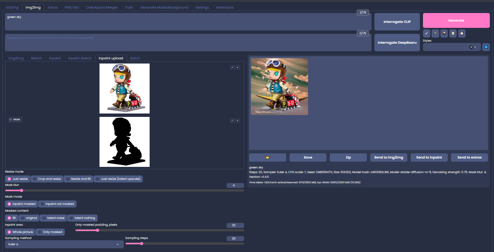

# Mask2Background for Stable Diffusion Web UI

The png image, transparent area replaced with white, and generate a black mask, and finally send the other to img-to-img, and then enter the prompt word to generate a new background, in short, it is to give the product for the background!

## Your png image must contain transparent pixels

[version](https://github.com/limithit/Mask2Background/)

## Installation

To install the software, please follow these steps:

* Open the `Extensions` tab on the AUTOMATIC1111's [Stable Diffusion Web UI](https://github.com/limithit/Mask2Background.git).
* Select the `Install from URL` option.
* Enter `https://github.com/limithit/Mask2Background.git` in the `URL for extension's git repository` field.
* Click on the `Install` button.
* Once installation is complete, restart the Web UI.
* Note: This extension supports v1.4.0 or higher of AUTOMATIC1111's Stable Diffusion Web UI.

## How update
* Delete the `extensions/Mask2Background` and then restart the Web UI.
* Repeat the first installation steps 

## Usage

* Drag and drop your image onto the input image area.
* Click on the `Run Fill the background` button.
*  Use sketching to point the area you want to inpaint. You can undo and adjust the pen size.
* Click on the `Create mask` button. The mask will appear in the selected mask image area.

### Mask only Tab

* Gives ability to just save mask without any other processing, so it's then possible to use the mask in img2img's `Inpaint upload` with any model/extensions/tools you already have in your AUTOMATIC1111.
* `Get mask` button: Save the mask as RGB image.
* After the `Get mask` button press you can use `Send to img2img inpaint` button under the mask image to send both input image and mask to the img2img tab.

## Auto-saving images

* The inpainted image will be automatically saved in the folder that matches the current date within the `outputs/Mask2Background` directory.
* You can switch to the `outputs/img2img-images` directory via the `Mask2Background` section found in the `Settings` tab on the Web UI.

## License

The source code is licensed under the [Apache 2.0 license](LICENSE).
